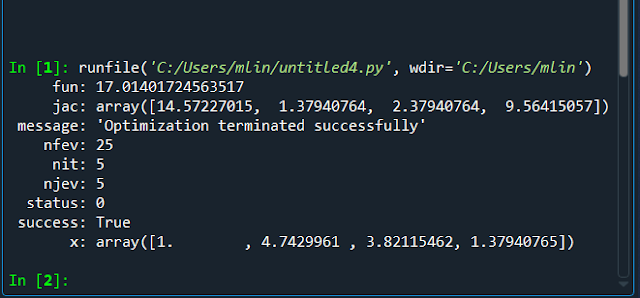

# 匯入MCM檔案到Q3D


```python
from pyaedt import Hfss3dLayout, Circuit

hfss = Hfss3dLayout(specified_version='2022.2', non_graphical=False)
hfss.import_brd("d:/demo/test.mcm")
hfss.create_setup('my_setup')
oModule = hfss.odesign.GetModule("SolveSetups")
oModule.ExportToQ3d("my_setup", "D:/demo/test.aedt")
```


<figure><figcaption></figcaption></figure>
